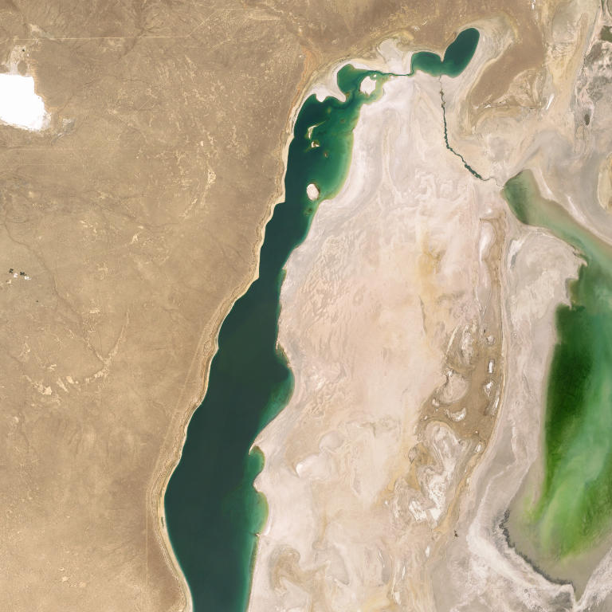
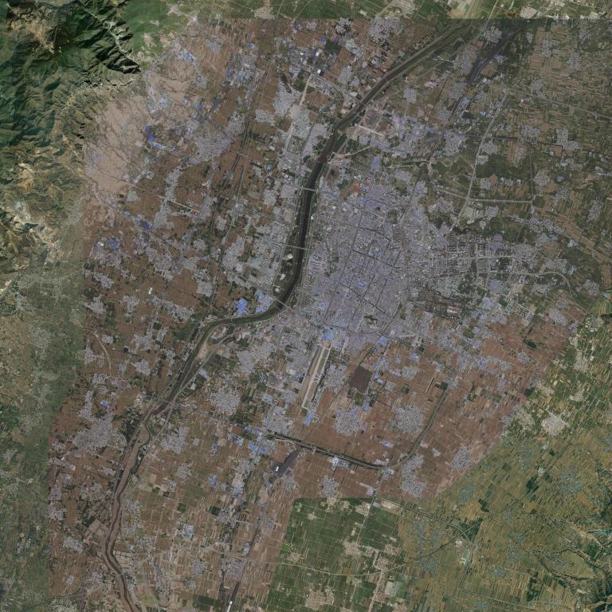
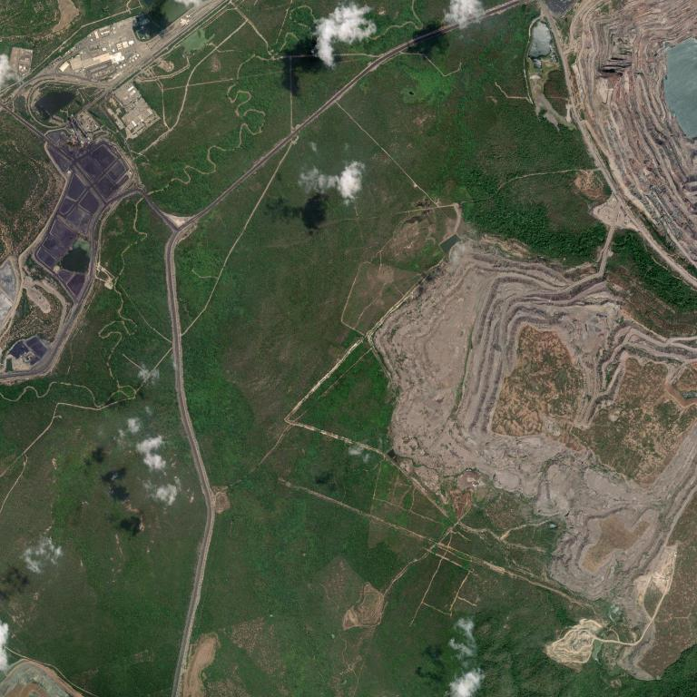

# Project Okavango — Group D

A lightweight environmental data analysis tool built for a two-day hackathon.
The app combines geospatial datasets from Our World in Data with AI-powered satellite image analysis to help identify at-risk natural regions of the world.

---

## Group Members

| Name | Student Number | Email |
|---|---|---|
| Afonso Freitas | 56668 | 56668@novasbe.pt |
| Estêvão Fernandes | 70576 | 70576@novasbe.pt |
| Francisco Neves | 56337 | 56337@novasbe.pt |
| Miguel Xu | 56323 | 56323@novasbe.pt |

**Outlook quick-copy:**
`56668@novasbe.pt; 70576@novasbe.pt; 56337@novasbe.pt; 56323@novasbe.pt`

---

## Installation

### 1. Clone the repository

```bash
git clone <repo-url>
cd Group_D
```

### 2. Create and activate a virtual environment

```bash
python -m venv .venv
# Windows
.venv\Scripts\activate
# macOS / Linux
source .venv/bin/activate
```

### 3. Install Python dependencies

```bash
pip install -r requirements.txt
```

### 4. Install Ollama

Download and install Ollama from [https://ollama.com](https://ollama.com).
Then pull the two models used by the app:

```bash
ollama pull moondream
ollama pull llama3.2
```

> If the models are not installed when you run the app, the pipeline will pull them automatically — but this may take several minutes on first run.

### 5. Run the app

```bash
streamlit run app/dashboard.py
```

The app will open in your browser. Data will be downloaded automatically on first launch.

---

## Project Structure

```
Group_D/
├── app/
│   ├── dashboard.py          # Page 1 — Environmental Maps
│   ├── ai_workflow.py        # AI pipeline (image download + Ollama)
│   ├── download_data.py      # Dataset downloader (Function 1)
│   ├── merge_data.py         # GeoPandas merger (Function 2)
│   └── pages/
│       └── 2_AI_Risk_Assessment.py  # Page 2 — AI Risk Assessment
├── database/
│   └── images.csv            # Logged pipeline runs
├── danger_images/            # README example images (danger detection)
├── downloads/                # Downloaded OWID + Natural Earth datasets
├── images/                   # Downloaded satellite images
├── notebooks/                # Prototyping notebooks
├── tests/                    # Pytest test suite
├── main.py                   # OkavangoData class
├── models.yaml               # AI model configuration
└── requirements.txt
```

---

## App Pages

### Page 1 — Environmental Maps
Visualises five environmental datasets on an interactive world map:
- Annual change in forest area
- Annual deforestation
- Share of terrestrial protected areas
- Share of degraded land
- Red List Index (biodiversity)

Includes a top-5 / bottom-5 country bar chart and per-country data lookup.

### Page 2 — AI Risk Assessment
1. Enter latitude, longitude, and zoom level.
2. A satellite image is downloaded from ESRI World Imagery.
3. The **moondream** vision model describes what is visible in the image.
4. The **llama3.2** text model answers five environmental risk questions based on the description and flags the area as **DANGER: YES** or **DANGER: NO**.
5. Results are cached in `database/images.csv` — re-running the same coordinates skips the models and returns the stored result instantly.

---

## Examples of Environmental Danger Detection

The following three examples demonstrate the app successfully identifying areas of environmental risk using satellite imagery and AI analysis.

### Example 1 — Aral Sea, Kazakhstan/Uzbekistan (Desertification & Water Stress)



**Coordinates:** Lat: 45.5, Lon: 58.5, Zoom: 9

The Aral Sea is one of the worst environmental disasters in modern history. Once the fourth-largest lake in the world, it has shrunk dramatically due to Soviet-era irrigation projects. The satellite image shows a desert landscape with a remaining body of water surrounded by sand dunes and barren terrain. The AI models detected signs of **soil erosion, land degradation, and desertification**, as well as **water stress**, correctly flagging the area as **DANGER: YES**.

### Example 2 — Linfen, Shanxi Province, China (Urban Sprawl & Land Degradation)



**Coordinates:** Lat: 36.1, Lon: 111.5, Zoom: 12

Linfen is located in China's coal belt and has historically been ranked among the most polluted cities in the world. The satellite image reveals a densely populated urban area with a river, surrounded by areas of varying vegetation health. The AI models identified **urban sprawl encroaching on natural areas** and signs of **deforestation and land degradation**, flagging the area as **DANGER: YES**.

### Example 3 — Cerrejón Coal Mine, La Guajira, Colombia (Mining, Erosion & Pollution)



**Coordinates:** Lat: 11.1, Lon: -72.6, Zoom: 14

The Cerrejón mine is one of the largest open-pit coal mines in the world. The satellite image shows a landscape scarred by mining activity, with visible deforestation, erosion patterns, and signs of pollution. The AI models detected **deforestation, soil erosion, pollution, and urban sprawl**, flagging the area as **DANGER: YES**.

---

## This Project and the UN Sustainable Development Goals

Project Okavango directly supports several of the United Nations' Sustainable Development Goals (SDGs), demonstrating how lightweight AI-powered tooling can contribute to global environmental accountability.

**SDG 15 — Life on Land**
This is the most directly relevant goal. The app tracks deforestation rates, land degradation, and biodiversity loss (via the Red List Index) at country level. The AI pipeline goes further, allowing any user to point at a location on Earth and receive an instant assessment of whether that area shows signs of environmental stress — from illegal clearing to soil erosion. Scaled up, this kind of tool could support rangers, NGOs, and governments in near-real-time land monitoring without expensive infrastructure.

**SDG 13 — Climate Action**
Forests are critical carbon sinks. Deforestation is one of the largest contributors to greenhouse gas emissions. By making deforestation and forest-change data visually accessible and combining it with satellite imagery, the app helps communicate the urgency of protecting forested areas in a way that raw data tables cannot. Early detection of land-cover change through the AI pipeline could inform faster policy responses.

**SDG 17 — Partnerships for the Goals**
The app is built entirely on free, open data (Our World in Data, Natural Earth, ESRI World Imagery) and open-source AI (Ollama). This means it can be reproduced and adapted by any organisation in the world — including those in lower-income countries with limited access to commercial analytical tools. Lowering the barrier to environmental analysis is itself a contribution to the spirit of SDG 17: leveraging technology and open knowledge for sustainable development.

**SDG 14 — Life Below Water** *(secondary)*
Coastal and riparian land degradation visible in satellite imagery often signals runoff, erosion, and pollution that ultimately reaches oceans and rivers. While the app is primarily land-focused, its risk assessment pipeline can detect visible water stress, reduced water bodies, and industrial activity near waterways — making it a useful secondary tool for coastal and freshwater monitoring.

In summary, Project Okavango demonstrates that a small team with open-source tools can build a credible proof-of-concept environmental monitoring system. With further development — higher-resolution imagery, larger AI models, and integration with real-time data feeds — tools like this could play a meaningful role in tracking progress towards the 2030 SDG targets.
